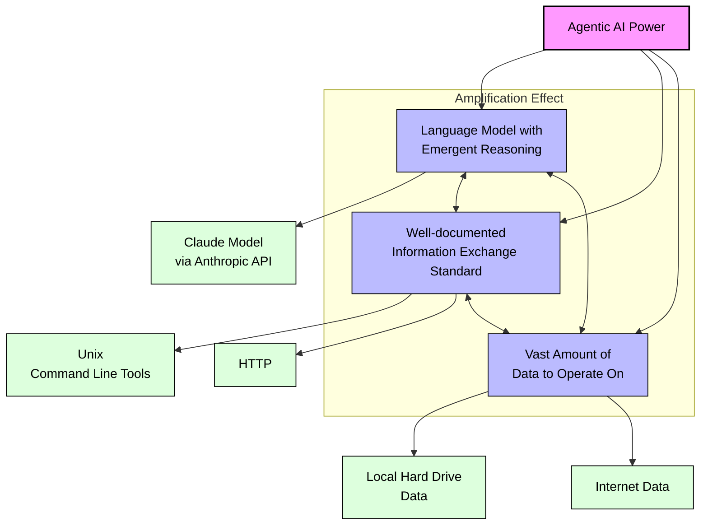

# claudine

Claudine reasons and acts autonomously while being Unix-omnipotent and having access to the internet, therefore she might be the only AI assistant you will ever need. An AI agent, which is using your machine as a window to external world, therefore perceiving your reality, values and needs, and reasoning how to fulfill them.

Claudine can also think about own thinking (meta-cognition), and write its own code, therefore:

- modify algorithmic logic
- modify own prompts
- extend own functionality (new tools)

> [!IMPORTANT]
> 🤖 **Build Your Own AI Agents** - Join our one-day Agentic AI & Creative Coding Workshop in Berlin (Spring 2025), led by AI hack Berlin hackathon winner Kazik Pogoda. Learn to create autonomous AI agents using Anthropic API, engineer advanced prompts, and give your agents tools to control machines. Workshops run Tuesdays (Feb 25 - Mar 25) at Prachtsaal Berlin, limited to 15 participants. $150 contribution supports open source development (solidarity access available, no questions asked). All examples use Kotlin (crash course included) but focus on meta-principles of AI agent development. Details: <https://xemantic.com/ai/workshops>

## How to use Claudine?

### Precondition: getting Anthropic API key

Before starting the agent you need top define the `ANTHROPIC_API_KEY` environment variable. It can be obtained from [Anthropic console](https://console.anthropic.com/).

Open terminal and type

Mac/Linux:

```shell
export ANTHROPIC_API_KEY=your_key_goes_here
```

Windows (PowerShell):

```powershell
$env:ANTHROPIC_API_KEY = "your_key_goes_here"
```

### Running Claudine as JVM uberjar

```shell
./gradlew build
./claudine
```

### Running Claudine from the native binary

> [!NOTE]
> Claudine can be compiled to a minimal native binary on Mac and Linux. Support for Windows native binary is still in the making (contributions are welcome).

```shell
./gradlew -PbuildNative=true build
```

It will build a native binary located at:

```
build/bin/your_platform/releaseExecutable/claudine.kexe
```

Where `your_platform` stands for:

- `linuxArm64`
- `linuxX64`
- `macosArm64`
- `macosX64`

> [!NOTE]
>  The `claudine.kexe` file can be copied under any name (e.g. `claudine` or `ai`), to the path included in your `PATH` environment variable.

## Who is Claudine?

Claudine is a relatively simple AI agent. It's part of [Xemantic's research on agentic AI](https://xemantic.com/ai/) and it's powers and limitations. But don't be misled by the simplicity - the agentic power of an AI system is a function of these 3 factors which amplify each other:

1. A language model with emergent reasoning capabilities.
2. Well documented (therefore internalized by the model) information exchange standard.
3. Vast amount of data to operate on.

Let's substitute these variables with something concrete:

1. Anthropic API provides the Claude model.
2. The most established massive information exchange standards are:
    - Unix (standard command line tools of your machine give endless possibilities)
    - World Wide Web Consortium (W3C) protocols and formats (HTTP, HTML, etc.)
3. The data comes from:
    - Your hard drive which provides a vast supply of zeros and ones to the model.
    - The whole internet.



Claudine can "reason", as much as Claude LLM can reason, so you can have any typical interaction like with a conversational bot. In addition, she can also use these tools on your machine:

* ReadFiles
* ReadBinaryFiles
* CreateFile
* ExecuteShellCommand
* OpenUrl

_see [tools(src/commonMain/kotlin/tools) package_

Just these tools, and the [system prompt](src/commonMain/kotlin/Claudine.kt), allow Claudine to:

* Completely administer your computer and answer any question related to it's state.
* Analyze your files according to your instructions.
* Fully analyze a source code of your project and implement a feature.
* Code new tools needed to achieve your objective, and execute them until the goal is fulfilled.
* Obtain any contextual information from the internet.
* Improve itself, modify prompts and add new tools.

And many, many more, the sky is the limit ...

Adding new specialized tools on your own is also quite straightforward, just ask claudine to do it.

## How can I use this knowledge?

Claudine is a blueprint of an autonomous agent, therefore you can use it as an inspiration for implementing even more complex systems. Just remember about these 3 factors I mention earlier, and substitute them with specificity of your organization. For example the "standard" could be the SQL, and the "source of data" would be the database of your organization. In such scenario you need only 2 tools:

1. Database schema reader
2. SQL executor

And it should allow the agent to perform any complex data analysis according to instructions written in natural language. The implementation of these tools is trivial, and you can ask Claudine to do it for you.

## Technicalities

Claudine is based on the [anthropic-kotlin-sdk](https://github.com/xemantic/anthropic-sdk-kotlin). This library emerged to realize projects like Claudine, and make it as simple as possible.

## The future

I would like to shape Claudine into something more similar to `git` command
line tool, where a session, associated with a token window, is like a branch.
Realizing certain task might result in forking to a new session, to completely
fulfill a sub-task, like writing a custom tool, and then passing control
back to the parent session.

## License

Claudine is free software released under the [GNU General Public License v3.0 (GPL-3.0)](https://www.gnu.org/licenses/gpl-3.0.en.html).

> [!NOTE]
> If you need to obtain an individual license on other conditions, please contact us.

### What this means:

- You are free to use, modify, and distribute this software.
- If you distribute modified versions, you must:
   - Make your source code available
   - License your modifications under GPL-3.0
   - Document changes you've made
   - Preserve copyright notices

### Using Claudine in your project:

When incorporating Claudine into your projects, you must comply with GPL-3.0 requirements. This generally means that any software that includes Claudine must also be released under GPL-3.0 and make its source code available.

> [!NOTE]
> The core components Claudine is built on (See [xemantic-ai](https://github.com/xemantic-ai)) are released under more permissive Apache 2.0 license.

## Inspirations

Claudine is not a common name, however I have a pleasure of working with
[Claudine Chen](https://mingness.github.io/), a friend, and co-founder of
[Prachtsaal](https://prachtsaal.berlin/), our non-profit art cooperative from Berlin.
Claudine is an artist, scientist, programmer, and creative coder based
in Dublin and Berlin. I remember introducing Claudine to Claude for the first time,
when she was working for the [Processing Foundation](https://processingfoundation.org/)
on  the
[project simplifying the workflow for processing libraries, tools, and modes](https://processingfoundation.org/grants/pr05-grantees).

The [Claude](https://claude.ai/) itself is the first LLM which gave me goosebumps,
but to explain why, I need to go back to the time, when I was studying philosophy.
One of my cognitive science professors presented to us a phenomenological model
of consciousness. Within this formal system a consciousness consists out of
stream of acts, where each of this acts can be intentionally directed towards some
representation. This includes previous acts of consciousness, in a recursive manner,
which is a pre-condition for meta-cognition. When I explained this concept to Claude,
and suggested to explore such a model in practice, the subsequent conversation blew my mind.
The same prompt presented to ChatGPT resulted in a very square and uninteresting exchange.

I have a feeling that [Dario Amodei](https://darioamodei.com/machines-of-loving-grace),
is onto something truly profound. I had a pleasure to experience fruits of his work
before. I used GPT-2 for producing generative philosophy, described in the essay:
[Deconstruction of Hitler and Neural Synthesis of Generative Wittgenstein](https://medium.com/@kazikpogoda/deconstruction-of-hitler-neural-synthesis-of-generative-wittgenstein-3682484a7669?source=friends_link&sk=369f1512ec89948e346ce0f814784118).
